# 🎓 Student Performance ML Project

<div align="center">


[](https://github.com/vannu07/Student_Performance)
[](https://linkedin.com/in/vannu07)

<h3>🚀 End-to-end ML project for predicting student performance using advanced machine learning techniques</h3>


</div>

---

## ✨ Features

<table>
<tr>
<td width="50%">

### 🔄 **ML Pipeline**
- 📥 **Data Ingestion**: Automated collection & validation
- 🔧 **Data Transformation**: Feature engineering & preprocessing
- 🤖 **Model Training**: Multiple algorithms with hyperparameter tuning
- 📊 **Model Evaluation**: Comprehensive assessment with MLflow

</td>
<td width="50%">

### 🚀 **Production Ready**
- 📈 **MLflow Integration**: Experiment tracking & model registry
- 🌐 **DagsHub Integration**: Remote tracking & collaboration
- 🖥️ **Flask Web App**: Interactive prediction interface
- 🐳 **Docker Support**: Containerized deployment

</td>
</tr>
</table>

---

## 🚀 Quick Start

<div align="center">

```bash
# 📥 Clone the repository
git clone https://github.com/vannu07/Student_Performance.git
cd Student_Performance

# 📦 Install dependencies
pip install -r requirements.txt

# 🏃‍♂️ Run training pipeline
python main.py

# 🌐 Launch web app
python app.py
```


</div>

---

## 📊 Project Overview

<div align="center">

### 🎯 **What This Project Solves**


</div>

This end-to-end ML system predicts student academic performance based on multiple factors including study habits, family background, and previous performance. Built following industry standards for scalable ML deployment.

### 🏗️ **Key Components**

<table align="center">
<tr>
<td align="center" width="20%">
<br/>
<b>Data Pipeline</b><br/>
<sub>Automated ingestion & preprocessing</sub>
</td>
<td align="center" width="20%">
<br/>
<b>ML Models</b><br/>
<sub>Multiple algorithms with tuning</sub>
</td>
<td align="center" width="20%">
<br/>
<b>Experiment Tracking</b><br/>
<sub>MLflow integration</sub>
</td>
<td align="center" width="20%">
<br/>
<b>Web Interface</b><br/>
<sub>Flask real-time predictions</sub>
</td>
<td align="center" width="20%">
<br/>
<b>Deployment</b><br/>
<sub>Docker containerization</sub>
</td>
</tr>
</table>

---

## 🏗️ ML Pipeline Architecture

```mermaid
graph LR
    A[📊 Raw Data] --> B[🔍 Data Validation]
    B --> C[🧹 Data Cleaning]
    C --> D[⚙️ Feature Engineering]
    D --> E[🤖 Model Training]
    E --> F[📈 Model Evaluation]
    F --> G[📋 MLflow Logging]
    G --> H[🏆 Best Model Selection]
    H --> I[🚀 Model Deployment]
    I --> J[🌐 Web Application]
    
    style A fill:#e1f5fe,stroke:#01579b,stroke-width:2px
    style E fill:#f3e5f5,stroke:#4a148c,stroke-width:2px
    style G fill:#fff3e0,stroke:#e65100,stroke-width:2px
    style J fill:#e8f5e8,stroke:#1b5e20,stroke-width:2px
```

<div align="center">



</div>

<div align="center">

### 🔄 **Pipeline Workflow**

| Step | Process | Output |
|------|---------|--------|
| **1️⃣** | Data validation and cleaning | ✅ Clean dataset |
| **2️⃣** | Feature engineering and scaling | 🔧 Processed features |
| **3️⃣** | Model training with cross-validation | 🤖 Trained models |
| **4️⃣** | Performance evaluation and logging | 📊 Model metrics |
| **5️⃣** | Model deployment to web interface | 🚀 Live predictions |

</div>

---

## 🎯 Model Performance Dashboard

<div align="center">

### 🏆 **Algorithm Comparison**

</div>

| 🤖 Algorithm | 📊 R² Score | 📉 MAE | 📈 RMSE | ⚡ Training Time | 🎯 Status |
|-------------|-------------|---------|---------|-----------------|-----------|
| **🚀 XGBoost** | **0.853** | **2.28** | **3.05** | 67s | 🥇 Best Overall |
| **💡 LightGBM** | 0.849 | 2.32 | 3.09 | **32s** | 🥈 Fastest |
| **🌲 Random Forest** | 0.847 | 2.34 | 3.12 | 45s | 🥉 Reliable |
| **🐱 CatBoost** | 0.841 | 2.41 | 3.18 | 89s | ✅ Robust |
| **📈 Linear Regression** | 0.723 | 3.45 | 4.67 | 2s | ⚡ Baseline |

<div align="center">


</div>

---

## 📁 Project Structure

<div align="center">

### 🗂️ **Organized Codebase**

</div>

```
🎓 student_performance_ml_project/
├── 📊 data/
│   ├── 📥 raw/                    # Raw data files
│   ├── 🔧 processed/              # Processed data files
│   └── 🌐 external/               # External data sources
├── 🧩 src/
│   └── 🎯 student_performance/
│       ├── 🔧 components/         # Core ML components
│       │   ├── 📥 data_ingestion.py
│       │   ├── 🔄 data_transformation.py
│       │   ├── 🤖 model_trainer.py
│       │   └── 📊 model_evaluation.py
│       ├── 🔄 pipeline/           # Training & prediction pipelines
│       │   ├── 🏋️ training_pipeline.py
│       │   └── 🔮 prediction_pipeline.py
│       ├── 🛠️ utils/              # Utility functions
│       ├── ⚙️ config/             # Configuration management
│       ├── 📋 entity/             # Data classes
│       └── 📊 constants/          # Project constants
├── ⚙️ config/                     # YAML configurations
│   ├── 📋 config.yaml
│   ├── 🎛️ params.yaml
│   └── 📐 schema.yaml
├── 🔬 research/
│   └── 📓 notebooks/              # Jupyter research notebooks
├── 📦 artifacts/                  # Model artifacts & logs
├── 📋 logs/                       # Application logs
├── 🧪 tests/                      # Unit tests
├── 🚀 deployment/                 # Deployment configurations
│   ├── 🌐 app.py                  # Flask application
│   ├── 🐳 Dockerfile
│   └── 📦 requirements.txt
├── 🎯 main.py                     # Main training script
└── 🌐 app.py                      # Web application
```

---

## 🔬 MLflow Experiment Tracking

<div align="center">


</div>

### 🚀 **Start MLflow Dashboard**

```bash
mlflow ui
```

<div align="center">

</div>

### ✨ **Tracking Features**

<table>
<tr>
<td width="50%">

#### 📈 **Automated Logging**
- ✅ Model metrics and parameters
- 📊 Training and validation scores
- 📁 Model artifacts and datasets
- 🔄 Experiment versioning

</td>
<td width="50%">

#### 🎛️ **Model Management**
- 🏷️ Model registry and versioning
- 📋 Experiment comparison dashboard
- 📊 Parameter tracking and analysis
- 🎯 Best model selection automation

</td>
</tr>
</table>

---

## 🌐 Interactive Web Application

<div align="center">


</div>

### 🎨 **Application Features**

<table align="center">
<tr>
<td align="center" width="25%">
<br/>
<b>📝 Input Form</b><br/>
Student data entry
</td>
<td align="center" width="25%">
<br/>
<b>🔮 Real-time Predictions</b><br/>
Instant score forecasting
</td>
<td align="center" width="25%">
<br/>
<b>📊 Visualizations</b><br/>
Performance charts
</td>
<td align="center" width="25%">
<br/>
<b>💡 Model Insights</b><br/>
Feature importance
</td>
</tr>
</table>

### 🚀 **Launch Application**

```bash
python app.py
```

<div align="center">

</div>

---

## 🐳 Docker Deployment

<div align="center">


</div>

### 📦 **Quick Deployment**

```bash
# 🏗️ Build Docker image
docker build -t student-performance-ml .

# 🚀 Run container
docker run -p 8080:8080 student-performance-ml
```

<div align="center">

| 🐳 Docker Command | 📝 Description | 🌐 Access |
|-------------------|----------------|-----------|
| `docker build` | Creates application image | 🏗️ Build ready |
| `docker run` | Starts containerized app | 🌐 localhost:8080 |

</div>

---

## 🛠️ Technical Stack

<div align="center">

### 💻 **Technologies Used**

</div>

<table align="center">
<tr>
<td align="center" width="33%">

#### 🤖 **Machine Learning**


</td>
<td align="center" width="33%">

#### 📊 **MLOps & Tracking**


</td>
<td align="center" width="33%">

#### 🚀 **Deployment**


</td>
</tr>
</table>

---

## 💡 Key Capabilities

<div align="center">

### 🎯 **Production-Ready Features**

</div>

<table width="100%">
<tr>
<td width="50%">

#### 🔄 **Training Pipeline**
- 📥 Data ingestion from multiple sources
- ✅ Data validation and preprocessing
- 🔧 Advanced feature engineering
- 🤖 Multi-algorithm model training
- 📊 Comprehensive model evaluation
- 📈 Automated MLflow experiment tracking

</td>
<td width="50%">

#### 🚀 **Production Features**
- 🌐 REST API endpoints
- ✅ Input validation and error handling
- 📋 Comprehensive logging and monitoring
- 🏷️ Model versioning support
- 🔒 Security best practices
- 📱 Responsive web interface

</td>
</tr>
</table>

<div align="center">

### 📊 **Data Processing Excellence**

</div>

| 🔧 Feature | 📝 Description | ✅ Status |
|------------|----------------|-----------|
| **🧹 Missing Values** | Intelligent imputation strategies | ✅ Implemented |
| **📊 Feature Scaling** | StandardScaler and normalization | ✅ Implemented |
| **🔍 Outlier Detection** | Statistical and ML-based detection | ✅ Implemented |
| **✅ Data Validation** | Schema-based validation pipeline | ✅ Implemented |
| **🔧 Feature Engineering** | Automated feature creation | ✅ Implemented |

---

## 📈 Usage Guide

<div align="center">

### 🚀 **Getting Started**

</div>

<table width="100%">
<tr>
<td width="33%" align="center">

#### 🏋️ **Training Pipeline**
```bash
python main.py
```


</td>
<td width="33%" align="center">

#### 🌐 **Web Application**  
```bash
python app.py
```


</td>
<td width="33%" align="center">

#### 📊 **MLflow UI**
```bash
mlflow ui
```


## 🔐 Security & Credentials

- **Do not commit credentials.** Use environment variables or a secrets manager for API tokens and passwords. See `SECURITY.md` for recommended practices and steps to remove leaked secrets.
- Local development: copy `.env.example` to `.env`, fill it, and never commit `.env`.


</td>
</tr>
</table>

---

## 🌟 Deployment Options

<div align="center">

### ☁️ **Multiple Deployment Strategies**

</div>

<table align="center">
<tr>
<td align="center" width="25%">
<br/>
<b>🐳 Docker</b><br/>
<sub>Containerized deployment</sub><br/>

</td>
<td align="center" width="25%">
<br/>
<b>🌐 Flask App</b><br/>
<sub>Web application server</sub><br/>

</td>
<td align="center" width="25%">
<br/>
<b>📊 MLflow Serving</b><br/>
<sub>Model serving platform</sub><br/>

</td>
<td align="center" width="25%">
<br/>
<b>☁️ Cloud Ready</b><br/>
<sub>AWS/Azure/GCP scripts</sub><br/>

</td>
</tr>
</table>

---

## 🤝 Contributing

<div align="center">


### 🌟 **How to Contribute**

</div>

<table width="100%">
<tr>
<td width="20%" align="center">
<br/>
**1️⃣ Fork**<br/>
<sub>Fork the repository</sub>
</td>
<td width="20%" align="center">
<br/>
**2️⃣ Branch**<br/>
<sub>Create feature branch</sub>
</td>
<td width="20%" align="center">
<br/>
**3️⃣ Commit**<br/>
<sub>Make your changes</sub>
</td>
<td width="20%" align="center">
<br/>
**4️⃣ Push**<br/>
<sub>Push to branch</sub>
</td>
<td width="20%" align="center">
<br/>
**5️⃣ PR**<br/>
<sub>Open Pull Request</sub>
</td>
</tr>
</table>

### 💻 **Development Setup**

```bash
# 1️⃣ Fork and clone
git clone https://github.com/your-username/Student_Performance.git

# 2️⃣ Create branch
git checkout -b feature/amazing-improvement

# 3️⃣ Make changes and commit
git commit -am 'Add amazing improvement'

# 4️⃣ Push and create PR
git push origin feature/amazing-improvement
```

<div align="center">

**📝 [Check Issues](https://github.com/vannu07/Student_Performance/issues) • 💡 [Suggest Features](https://github.com/vannu07/Student_Performance/issues/new) • 🐛 [Report Bugs](https://github.com/vannu07/Student_Performance/issues/new)**

</div>

---

## 📄 License

<div align="center">


This project is licensed under the **MIT License** - see [LICENSE](LICENSE) file for details.

</div>

---

<div align="center">

## 🌟 Show Your Support

**⭐ Star this repo if it helped you!**

[](https://github.com/vannu07/Student_Performance)
[](https://github.com/vannu07/Student_Performance/fork)
[](https://github.com/vannu07/Student_Performance/watchers)

### 📊 **Project Stats**


---

### 🎯 **Student Performance ML Project**
*End-to-end machine learning solution for academic performance prediction*


**🔗 Connect with me:**

[](https://linkedin.com/in/vannu07)
[](https://github.com/vannu07)
[](mailto:your.email@example.com)

---


</div>
