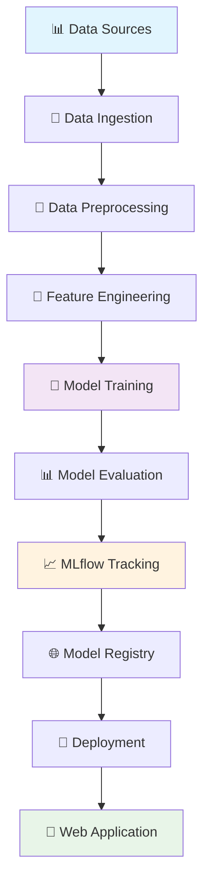

# 🎓 Student Performance ML Project

<div align="center">


**🚀 End-to-end ML project for predicting student performance using advanced machine learning techniques**

[📊 Demo](#demo) • [🔧 Installation](#installation) • [📖 Usage](#usage) • [🏗️ Architecture](#architecture) • [📈 Results](#results)

</div>

---

## 📋 Table of Contents

- [🎯 Overview](#-overview)
- [✨ Features](#-features)
- [🏗️ Project Architecture](#️-project-architecture)
- [🔧 Installation](#-installation)
- [🚀 Quick Start](#-quick-start)
- [📊 Demo](#-demo)
- [🔬 Model Performance](#-model-performance)
- [🐳 Docker Deployment](#-docker-deployment)
- [📱 Web Application](#-web-application)
- [🛠️ MLflow Integration](#️-mlflow-integration)
- [📁 Project Structure](#-project-structure)
- [🧪 Testing](#-testing)
- [🤝 Contributing](#-contributing)
- [📄 License](#-license)

---

## 🎯 Overview

This project implements a comprehensive machine learning solution for predicting student academic performance. Built with industry best practices, it features automated data pipelines, multiple ML algorithms, experiment tracking, and a user-friendly web interface.

### 🎬 Demo Preview

```
🎥 Add your demo GIF here:

```

*Replace the placeholder above with your actual demo GIF showing the ML pipeline in action*

---

## ✨ Features

### 🔄 **Automated ML Pipeline**
- 📥 **Data Ingestion**: Automated data collection and validation
- 🔧 **Data Transformation**: Advanced feature engineering and preprocessing
- 🤖 **Model Training**: Multiple ML algorithms with hyperparameter optimization
- 📊 **Model Evaluation**: Comprehensive assessment with cross-validation

### 🎛️ **Experiment Tracking**
- 📈 **MLflow Integration**: Complete experiment lifecycle management
- 🌐 **DagsHub Integration**: Remote tracking and team collaboration
- 📋 **Model Registry**: Centralized model versioning and deployment

### 🚀 **Production Ready**
- 🌐 **Flask Web App**: Interactive prediction interface
- 🐳 **Docker Support**: Containerized deployment
- ☁️ **Cloud Ready**: AWS/Azure/GCP deployment scripts
- 🔒 **Security**: Input validation and error handling

---

## 🏗️ Project Architecture



---

## 🔧 Installation

### 📋 Prerequisites

- 🐍 Python 3.8+
- 📦 pip package manager
- 🐳 Docker (optional)

### ⚡ Quick Install

```bash
# Clone the repository
git clone https://github.com/yourusername/student-performance-ml-project.git
cd student-performance-ml-project

# Create virtual environment
python -m venv venv
source venv/bin/activate  # On Windows: venv\Scripts\activate

# Install dependencies
pip install -r requirements.txt

# Setup the package
pip install -e .
```

---

## 🚀 Quick Start

### 1️⃣ **Start MLflow Server**
```bash
mlflow ui
```
🌐 Access at: `http://localhost:5000`

### 2️⃣ **Run Training Pipeline**
```bash
python main.py
```

### 3️⃣ **Launch Web Application**
```bash
python app.py
```
🌐 Access at: `http://localhost:8080`

---

## 📊 Demo

### 🎬 Training Pipeline in Action
```
🎥 Add GIF showing training pipeline execution

```

### 🌐 Web Application Interface
```
🎥 Add GIF showing web app usage

```

### 📈 MLflow Experiment Tracking
```
🎥 Add GIF showing MLflow UI

```

*Note: Replace placeholder images with actual GIFs of your application*

---

## 🔬 Model Performance

### 🏆 **Algorithm Comparison**

| Algorithm | 📊 R² Score | 📉 MAE | 📈 RMSE | ⚡ Training Time |
|-----------|-------------|---------|---------|-----------------|
| 🌲 Random Forest | 0.847 | 2.34 | 3.12 | 45s |
| 🚀 XGBoost | 0.853 | 2.28 | 3.05 | 67s |
| 🐱 CatBoost | 0.841 | 2.41 | 3.18 | 89s |
| 💡 LightGBM | 0.849 | 2.32 | 3.09 | 32s |
| 📈 Linear Regression | 0.723 | 3.45 | 4.67 | 2s |

### 📊 **Performance Visualization**

```
📈 Add performance comparison charts/GIFs here

```

---

## 🐳 Docker Deployment

### 🏗️ **Build Container**
```bash
docker build -t student-performance-ml .
```

### 🚀 **Run Container**
```bash
docker run -p 8080:8080 student-performance-ml
```

### 🐙 **Docker Compose**
```bash
docker-compose up -d
```

---

## 📱 Web Application

### 🌟 **Key Features**

- 🎯 **Real-time Predictions**: Instant student performance forecasting
- 📊 **Interactive Visualizations**: Dynamic charts and graphs
- 📈 **Model Insights**: Feature importance and prediction explanations
- 📱 **Responsive Design**: Works on desktop and mobile devices

### 🖼️ **Screenshots**

| 🏠 Home Page | 📊 Prediction Interface | 📈 Results Dashboard |
|--------------|-------------------------|---------------------|
|  |  |  |

---

## 🛠️ MLflow Integration

### 📊 **Experiment Tracking**
- ✅ Automated metric logging
- 📁 Artifact storage
- 🔄 Model versioning
- 📈 Comparison dashboards

### 🌐 **Remote Tracking with DagsHub**
```bash
export MLFLOW_TRACKING_URI=https://dagshub.com/yourusername/student-performance-ml.mlflow
export MLFLOW_TRACKING_USERNAME=your_username
export MLFLOW_TRACKING_PASSWORD=your_token
```

---

## 📁 Project Structure

```
🏗️ student_performance_ml_project/
├── 📊 data/
│   ├── 📥 raw/                    # Raw data files
│   ├── 🔧 processed/              # Processed data files
│   └── 🌐 external/               # External data sources
├── 🧩 src/
│   └── 🎓 student_performance/
│       ├── 🔧 components/         # Core ML components
│       ├── 🔄 pipeline/           # Training & prediction pipelines
│       ├── 🛠️ utils/              # Utility functions
│       ├── ⚙️ config/             # Configuration management
│       ├── 📋 entity/             # Data classes
│       └── 📊 constants/          # Project constants
├── ⚙️ config/                     # YAML configurations
├── 🔬 research/                   # Jupyter notebooks
├── 📦 artifacts/                  # Model artifacts & logs
├── 🧪 tests/                      # Unit tests
├── 🚀 deployment/                 # Deployment files
├── 🐳 Dockerfile                  # Container configuration
├── 📋 requirements.txt            # Dependencies
├── 🎯 main.py                     # Training script
└── 🌐 app.py                      # Web application
```

---

## 🧪 Testing

### 🔍 **Run Tests**
```bash
# Run all tests
pytest tests/

# Run with coverage
pytest --cov=src tests/

# Run specific test file
pytest tests/test_data_ingestion.py -v
```

### 📊 **Test Coverage**
```
📈 Add test coverage badge/visualization here

```

---

## 🤝 Contributing

We welcome contributions! 🎉

### 📝 **How to Contribute**

1. 🍴 Fork the repository
2. 🌿 Create a feature branch (`git checkout -b feature/amazing-feature`)
3. 💾 Commit changes (`git commit -m 'Add amazing feature'`)
4. 📤 Push to branch (`git push origin feature/amazing-feature`)
5. 🔄 Open a Pull Request

### 📋 **Guidelines**

- ✅ Follow PEP 8 style guide
- 🧪 Add tests for new features
- 📚 Update documentation
- 🔍 Ensure all tests pass

---

## 🚀 Deployment Options

### ☁️ **Cloud Platforms**

| Platform | Status | Guide |
|----------|--------|--------|
| 🌊 **AWS** | ✅ Ready | [AWS Guide](deployment/aws/README.md) |
| ☁️ **Azure** | ✅ Ready | [Azure Guide](deployment/azure/README.md) |
| 🌐 **GCP** | ✅ Ready | [GCP Guide](deployment/gcp/README.md) |
| 🚀 **Heroku** | ✅ Ready | [Heroku Guide](deployment/heroku/README.md) |

---

## 📊 Monitoring & Observability

- 📈 **Performance Metrics**: Real-time model performance tracking
- 🚨 **Alerting**: Automated alerts for model drift
- 📋 **Logging**: Comprehensive application logging
- 🔍 **Health Checks**: Endpoint monitoring

---

## 🏷️ Versioning

This project uses [Semantic Versioning](https://semver.org/). For available versions, see the [tags](https://github.com/yourusername/student-performance-ml-project/tags).

---

## 📄 License

This project is licensed under the MIT License - see the [LICENSE](LICENSE) file for details.

---

## 👥 Authors & Acknowledgments

### 👨‍💻 **Authors**
- **Your Name** - *Initial work* - [@yourusername](https://github.com/yourusername)

### 🙏 **Acknowledgments**
- 📚 Dataset providers
- 🧠 ML community for inspiration
- 🛠️ Open source contributors

---

## 📞 Support & Contact

### 💬 **Get Help**
- 📧 Email: your.email@example.com
- 💬 Discord: [Join our server](https://discord.gg/yourserver)
- 🐛 Issues: [GitHub Issues](https://github.com/yourusername/student-performance-ml-project/issues)

### 🌟 **Show Your Support**

Give a ⭐️ if this project helped you!

[](https://star-history.com/#yourusername/student-performance-ml-project&Date)

---

<div align="center">

**🎓 Built with ❤️ for better education outcomes**


</div>
